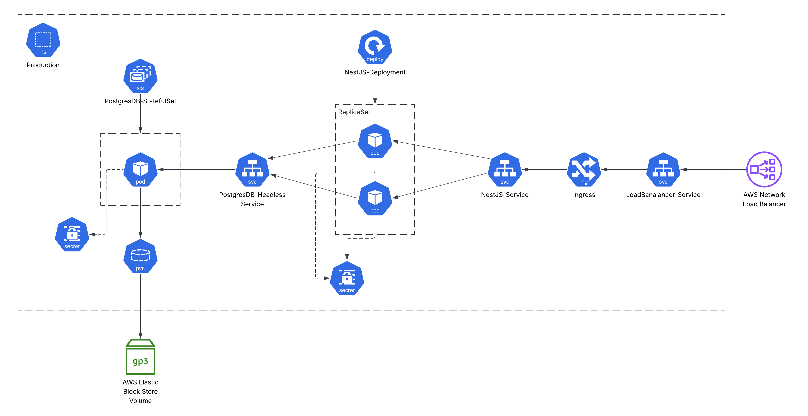

# NestJS Application Deployment for Kubernetes

This repository contains the Kubernetes manifests, packaged as a Helm chart, for deploying a NestJS web application. It is designed to be used as a source of truth for a GitOps workflow with [ArgoCD](https://argo-cd.readthedocs.io/en/stable/).

The deployment includes the NestJS application itself, a PostgreSQL database, and leverages Flagger for progressive delivery (canary releases).

---

## 📋 Prerequisites

Before deploying this application, ensure the following components are installed and configured in your EKS cluster:

* **Amazon EKS Cluster:** A running Kubernetes cluster on AWS.
* **Helm:** The package manager for Kubernetes.
* **AWS EBS CSI Driver:** Required for provisioning the `PersistentVolume` used by the PostgreSQL database. This allows Kubernetes to manage AWS EBS volumes dynamically.
* **Nginx Ingress Controller:** Manages external access to the services in the cluster, primarily for handling traffic shifting during canary deployments.

---

## 🚀 Application Overview


The application consists of several core components that work together to provide a resilient and observable system.

### 🐘 PostgreSQL Database

The database is the stateful backend for our application.

* **Workload:** Deployed as a `StatefulSet` to ensure stable network identifiers and persistent storage for each pod.
* **Storage:** Utilizes a dynamic `PersistentVolumeClaim` (PVC) that provisions an AWS EBS volume via the EBS CSI driver.
* **Monitoring:** Includes a sidecar container that exposes database metrics in a Prometheus-compatible format.
* **Note:** For a production environment, it is critical to implement a robust backup and restore strategy. This could involve using tools like [Velero](https://velero.io/) for cluster-wide backups or creating custom `pg_dump` scripts that push backups to a secure location like an S3 bucket.

### 🌐 NestJS Web Application

This is the core web application, managed by Flagger to ensure safe and automated deployments.

* **Workload:** A Kubernetes `Deployment` that is managed by a **Flagger** `Canary` custom resource. This setup enables progressive delivery.
* **Monitoring:** The application exposes a `/metrics` endpoint with Prometheus-compatible metrics. **Flagger** uses these metrics to perform automated analysis during a canary rollout, promoting or rolling back the release based on the results.

### 🌉 Ingress & DNS

These components manage how traffic reaches the application.

* **Nginx Ingress Controller:** Manages all incoming traffic. **Flagger** integrates with it to precisely shift traffic between the stable and canary versions of the application during a deployment.
* **ExternalDNS & Cert-Manager:** These are recommended for production environments to automate the creation of public DNS records and the provisioning/renewal of TLS certificates for secure HTTPS traffic.

---

## ⚙️ Installation

You can deploy this application using the Helm chart located in this repository.

1.  **Clone the repository:**
    ```bash
    git clone <your-repository-url>
    cd <repository-directory>
    ```

2.  **Install the Helm chart:**
    Use the `helm install` command to deploy the application. You must provide a release name and specify the namespace where you want to deploy it.

    ```bash
    helm install my-app ./helm-chart --namespace my-namespace --create-namespace
    ```
    * `my-app`: This is the release name for your deployment.
    * `./helm-chart`: This should be the path to the directory containing the Helm chart.
    * `--namespace my-namespace`: Specifies the target namespace.
    * `--create-namespace`: This flag will create the namespace if it doesn't already exist.

---

## 🔧 Configuration

The Helm chart is configurable via the `values.yaml` file. You can override the default settings by creating your own values file or by using the `--set` flag during installation.

### Changing the Application Image

To update the NestJS application to a new version, you need to change the container image tag. You can do this in two ways:

**1. Using `--set` flag (for quick changes):**
Provide the new image and tag directly in the `helm upgrade` command.

```bash
helm upgrade my-app ./helm-chart \
  --namespace my-namespace \
  --set nestjs.deployment.image=oussamabal/devops-project:new-tag
```

**2. Modifying `values.yaml` (for GitOps):**
For a GitOps workflow, the recommended approach is to modify the `values.yaml` file directly, commit the change, and push it to the repository. ArgoCD will automatically detect the change and apply the update.

Open the `values.yaml` file for the chart and update the following section:

```yaml
# values.yaml

nestjs:
  deployment:
    name: nestjs-app
    # Update the image tag here
    image: oussamabal/devops-project:07ae9673
```

After changing the image to `oussamabal/devops-project:new-version`, commit and push the file. ArgoCD will handle the rest.
